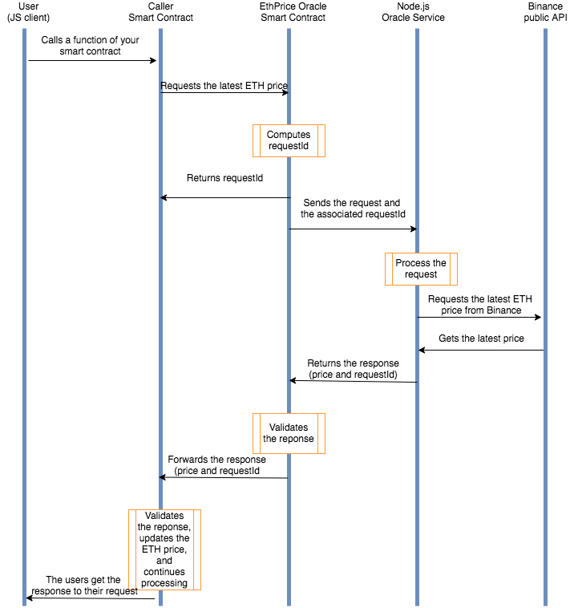

# ETHUSDT Price Oracle

Ethereum-Dollar price oracle that calls upon Binance's public API. 

## What is an oracle?

Blockchain oracles are third-party services that provide smart contracts with external information. Oracles provide a link between off-chain and on-chain data and are vital within the blockchain ecosystem because they broaden the scope in which smart contracts can operate.




# Getting Started
## Environment variables
- configure env for `./client`
```sh
cp .env-sample .env
```

- configure env for `./server`
```sh
cd ./server
cp .env-sample .env
```
Note: configure your environment variables in the `.env` file before compile.

## server
- compile server binary
```sh
cargo build --release
```

- run the service
```sh
RUST_LOG=info ./target/release/oracle-service
```

## client
- run `updateEthPrice` and listen event `PriceUpdatedEvent`
```sh
# install dependency
yarn

# run client call and listen event
yarn start client/src/caller-core.ts
```
